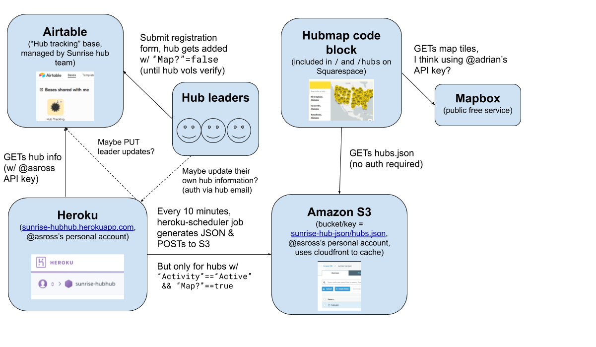

# Hubhub: Sunrise Hub Map + Airtable 

This repository contains code to help integrate Airtable (the current canonical source of hub data) with the [Sunrise hub map](https://www.sunrisemovement.org/hubs), as well as a web interface to help hubs manage their own data.

## High-level summary

Using the [Airtable](https://airtable.com/) API, Hubhub (hosted on [Heroku](https://www.heroku.com/)) pulls hub data in [`airtable.rb`](./airtable.rb), converts it to a JSON blob, and pushes it to Amazon S3 in [`scripts/upload_hub_json.rb`](./scripts/upload_hub_json.rb), which is run every 10 minutes by a job scheduler. This JSON blob is then loaded by the hub map in [`public/hub_map.html`](./public/hub_map.html). We can summarize all of this with the following diagram:

Note that currently, some parts of this infrastructure are being run on personal rather than Sunrise-managed accounts. Traffic to this application is currently low enough that Heroku's free tier (and email addons) are more than sufficient, and Amazon S3 storage costs are almost nothing. However, we could face issues scaling.

## Contributing

### Steps to run locally

- clone and `cd` into this repository
- download Ruby 2.6.3
    - if using mac, likely easiest by installing [rbenv](https://github.com/rbenv/rbenv)
    - if additionally using Homebrew, you can run `brew install rbenv && rbenv init && rbenv install 2.6.3`
- run `bundle install` to install dependencies
- ensure `rake test` passes
- set [environment variables](./.env.example) -- note that this may require requesting access to the production or staging Airtable first.
- run `./serve` to view the app
- in development mode, check your logs in the terminal window to find the login link

### Repository structure

- [`airtable.rb`](./airtable.rb) contains the core data modeling. It's mostly a thin wrapper on top of Airtable's API, developed with the excellent [airrecord](https://github.com/Sirupsen/airrecord) library, but it also includes all of the business logic for converting Airtable data into the hub map JSON payload.
- [`app.rb`](./app.rb) and all of the templates in [`views/`](./views/) contain the primary code for the web interface that hubs can use to manage their own data, built using [sinatra](http://sinatrarb.com/).
- [`magic_link.rb`](./magic_link.rb) contains the login logic for hub data management. It handles generating, emailing, and verifying one-time-use login links that get sent to designated hub emails.
